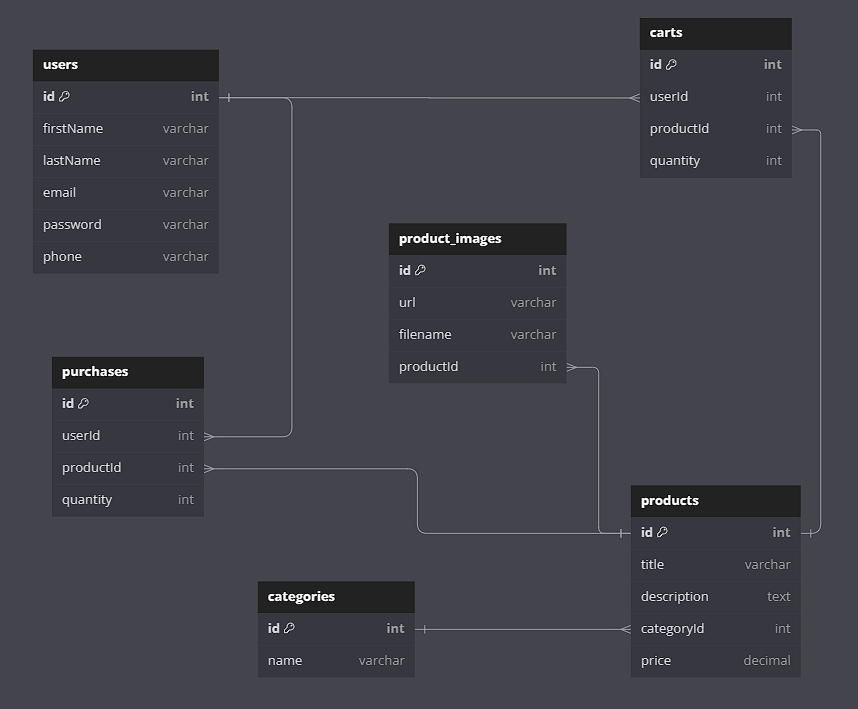

# eCommerce API

Este es un proyecto de backend para una aplicación de eCommerce que proporciona endpoints para gestionar usuarios, categorías, productos, carritos de compra, compras y imágenes de productos.

## Modelos y Endpoints

### Users

Este modelo representa a los usuarios de la plataforma.

- **Campos:**

  - `firstName`: Nombre del usuario.
  - `lastName`: Apellido del usuario.
  - `email`: Correo electrónico del usuario.
  - `password`: Contraseña del usuario.
  - `phone`: Número de teléfono del usuario.

- **Endpoints:**
  - `GET /users` (privado)🔐: Obtiene la lista de usuarios.
  - `POST /users` (público): Crea un nuevo usuario.
  - `DELETE /users/:id` (privado)🔐: Elimina un usuario por ID.
  - `PUT /users/:id` (privado)🔐: Actualiza la información de un usuario por ID.
  - `POST /users/login` (público): Inicia sesión un usuario.

### Category

Este modelo representa las categorías de productos.

- **Campos:**

  - `name`: Nombre de la categoría.

- **Endpoints:**
  - `GET /categories` (público): Obtiene la lista de categorías.
  - `POST /categories` (privado)🔐: Crea una nueva categoría.
  - `DELETE /categories` (privado)🔐: Elimina una categoría.

### Product

Este modelo representa los productos disponibles en la tienda.

- **Campos:**

  - `title`: Título del producto.
  - `description`: Descripción del producto.
  - `categoryId`: ID de la categoría a la que pertenece el producto.
  - `price`: Precio del producto.

- **Endpoints:**
  - `GET /products` (público): Obtiene la lista de productos.
  - `POST /products` (privado)🔐: Crea un nuevo producto.
  - `GET /products/:id` (público): Obtiene un producto por ID.
  - `DELETE /products/:id` (privado)🔐: Elimina un producto por ID.
  - `PUT /products/:id` (privado)🔐: Actualiza un producto por ID.
  - `POST /products/:id/images` (privado)🔐: Agrega imágenes a un producto (pendiente para el viernes).

### Cart

Este modelo representa el carrito de compras de un usuario.

- **Campos:**

  - `userId`: ID del usuario propietario del carrito.
  - `productId`: ID del producto en el carrito.
  - `quantity`: Cantidad del producto en el carrito.

- **Endpoints:**
  - `GET /cart` (privado)🔐: Obtiene los productos en el carrito del usuario logueado.
  - `GET /cart/:id` (privado)🔐: Obtiene un producto específico del carrito del usuario logueado.
  - `POST /cart` (privado)🔐: Añade productos al carrito del usuario logueado.
  - `DELETE /cart` (privado)🔐: Elimina los productos del carrito del usuario logueado.
  - `PUT /cart` (privado)🔐: Actualiza la cantidad (`quantity`) de productos en el carrito.

### Purchase

Este modelo representa las compras realizadas por un usuario.

- **Campos:**

  - `userId`: ID del usuario que realizó la compra.
  - `productId`: ID del producto comprado.
  - `quantity`: Cantidad del producto comprado.

- **Endpoints:**
  - `GET /purchase` (privado)🔐: Obtiene las compras del usuario logueado.
  - `POST /purchase` (privado)🔐: Realiza una compra tomando los productos del carrito del usuario logueado y pasándolos a la tabla de compras, eliminándolos del carrito.

### ProductImg

Este modelo representa las imágenes de los productos.

- **Campos:**

  - `url`: URL de la imagen.
  - `filename`: Nombre del archivo de la imagen.
  - `productId`: ID del producto al que pertenece la imagen.

- **Endpoints:**
  - `GET /product_images` (privado)🔐: Obtiene las imágenes de los productos.
  - `POST /product_images` (privado)🔐: Agrega una nueva imagen a un producto.
  - `DELETE /product_images` (privado)🔐: Elimina una imagen de un producto.

## Instalación

1. Clona el repositorio.
2. Instala las dependencias con `npm install`.
3. Configura las variables de entorno según el archivo `.env.example`.
4. Inicia el servidor con `npm start`.

## Pruebas

Ejecuta las pruebas con `npm test`.
